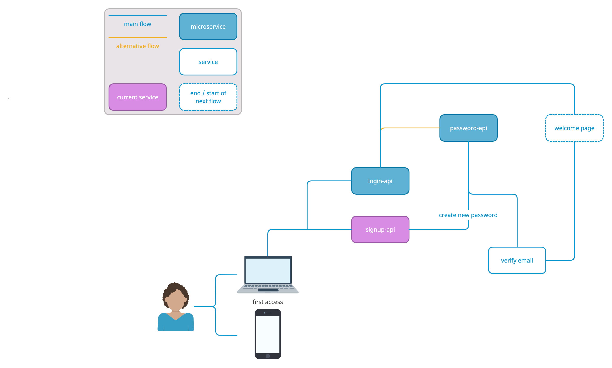

# dtwo-signup

 

###### Project made for study purposes.
This repoisitory is part of a login/signup microservices structure meant to serve as a general flow for future projects.
_______________________________
### Building and running
- To **install dependencies** for this project, use the `mvn install` command inside the root directory.
- To **build** this project with tests, use the `mvn clean test` command inside the root directory.
- To **run SpringBoot** project and utilize it's endpoints, use `mvn spring-boot:run` command inside the root directory.

| microservices flow                      |
|---------------------------------------- |
|  |
